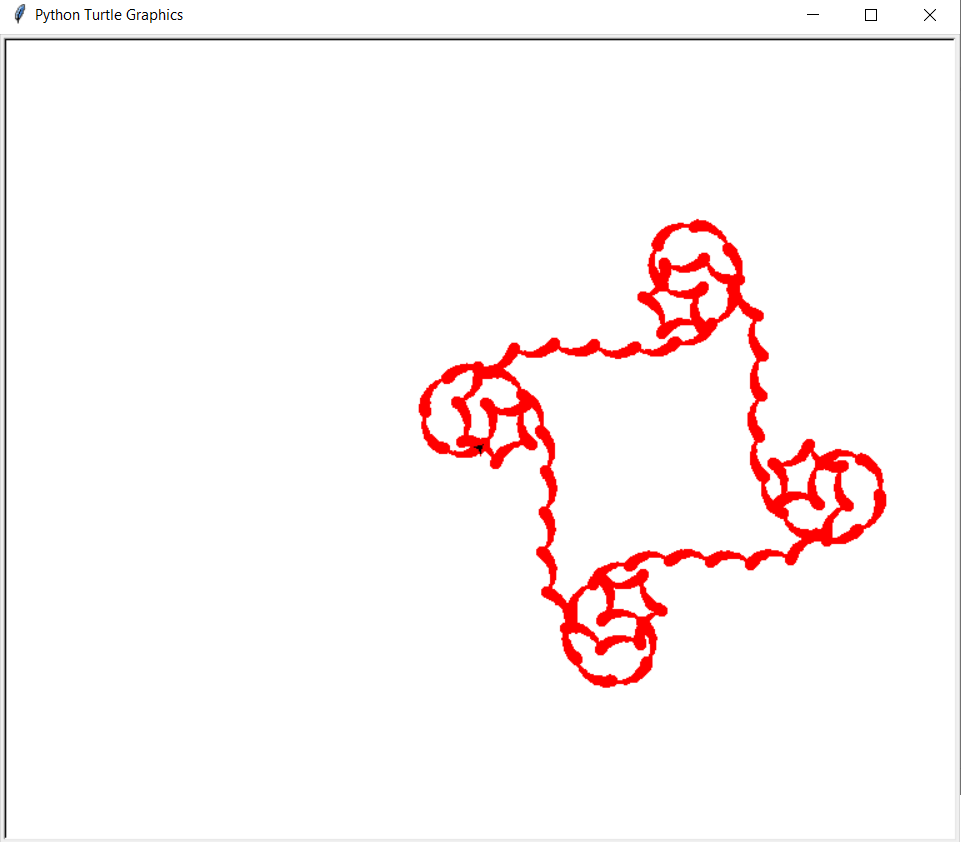

# Turtle Examples Using Loops
This project shows some simple patterns that can be created in Turtle. Most of these examples make use of loops.

## Examples

### Using Loops for Color
```python
import turtle

t = turtle.Turtle()
t.speed("fastest")
t.penup()
t.goto(-100, 200)
t.pendown()

color_r = 0
color_g = 0
color_b = 0
turtle.Screen().colormode(255)

isLeft = True

for n in range(0, 768):
  isLeft = not(isLeft)
  if (color_r < 255):
    color_r += 1
  elif (color_g < 255):
    color_g += 1
  elif (color_b < 255):
    color_b += 1
  t.pencolor((color_r, color_g, color_b))
  t.forward(50)
  if isLeft:
    t.left(179.5)
  else:
    t.right(179.5)
```


### Drawing Circles with Loops

#### Rings
```python
import turtle

t = turtle.Turtle()
t.speed("fastest")

for n in range(0, 5): # number of circles
  for i in range(0, 72):    # iterations per circle
    t.forward(5)  # length to draw by
    t.right(5)  # rotate by 5 degrees
  t.forward(10) # move to next circle
```


------------

#### Spring
```python
import turtle

t = turtle.Turtle()
t.speed("fastest")

t.penup()
t.goto(0, 200)
t.pendown()

for n in range(0, 4):  # number of spiral loops
  for i in range(0, 72):    # iterations for drawing one circle
    t.forward(0.1 + i/10)
    t.left(5)
```


------------------

#### Donut
```python
import turtle

t = turtle.Turtle()
t.speed("fastest")

for n in range(0, 36):  # number of circles
  for i in range(0, 36):    # iterations for drawing one circle
    t.forward(3)
    t.left(10)
  t.forward(6)
  t.left(10)
  t.forward(6)
```


----------

#### Circular Pattern
```python
import turtle

t = turtle.Turtle()
t.speed("fastest")

for n in range(0, 36):  # number of circles
  for i in range(0, 72):    # iterations for drawing one circle
    t.forward(5)
    t.left(5)
  t.forward(10)
  t.left(10)
  t.forward(10)
```


### Varying Pensize

#### Changing Pensize Demo
```python
import turtle

t = turtle.Turtle()
t.shape("turtle")
t.fillcolor("red")

for i in range(0, 20):
  t.pensize(i)
  t.forward(5)

t.penup()
t.forward(50)
```


----------

#### Drawing a Circle
```python
import turtle

t = turtle.Turtle()
t.shape("turtle")
t.fillcolor("red")

pensize = 1
for i in range(0, 120):
  pensize += 0.5
  t.pensize(pensize)
  if i % 20 == 0:
    pensize = 1
  t.forward(3)
  t.left(3)
```


-------------

#### Circular Pattern (with varying pensize)
```python
import turtle

t = turtle.Turtle()
t.speed("fastest")

for n in range(0, 36):  # number of circles
  pensize = 0
  for i in range(0, 72):    # iterations for drawing one circle
    pensize += 0.1
    t.pensize(pensize)
    t.forward(5)
    t.left(5)
  t.forward(10)
  t.left(10)
  t.forward(10)
```


-------------

#### Pattern using Pensize
```python
import turtle

t = turtle.Turtle()
t.pencolor("red")
t.speed("fastest")
t.left(45)

for n in range(0, 4):
    for i in range(0, 18):
        i = 180 - i * 10
        pensize = 1
        for x in range(0, 18):
            pensize += 0.5
            t.pensize(pensize)
            t.forward(2)
            t.left(5)
        
        t.right(i)
```


### Spirals

#### Basic Spiral (Archimedean Spiral)
```python
import turtle

t = turtle.Turtle()
t.speed("fastest")

for i in range(0, 360):
  t.forward(0.1 + i/10)
  t.left(5)
```


-------------

Varying draw length by casting to int
```python
import turtle

t = turtle.Turtle()
t.speed("fastest")

for i in range(0, 720):
  t.forward(0.5 + (int)(i/100))
  t.left(5)
```


-------------

#### Fibonacci Spiral
```python
import turtle

# turtle window
wn = turtle.Screen()
wn.setup(1920, 1080)
wn.bgcolor("orange")
wn.title("Python Turtle Graphics - Fibonacci Spiral")

# create drawer turtle
t = turtle.Turtle()
t.shape("turtle")
t.speed("fastest")
t.right(90)
t.penup()
t.goto(250, -150)
t.pendown()

fibonacci1 = 0
fibonacci2 = 1

for n in range(0, 16): # number of fibonacci iterations
  # draw one spiral
  for i in range(0, 90):  # 90 degrees
    t.left(1)
    t.forward(fibonacci2*0.01)
  
  old = fibonacci2
  fibonacci2 = fibonacci1 + fibonacci2
  fibonacci1 = old
```

